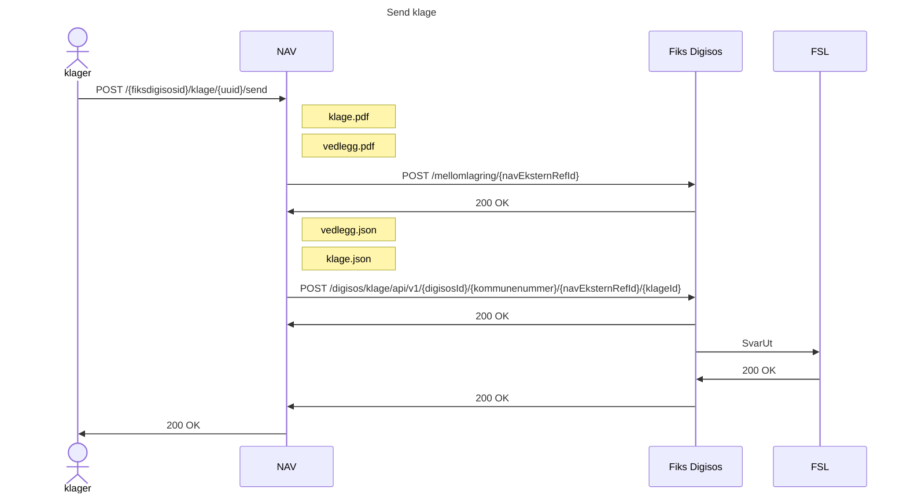
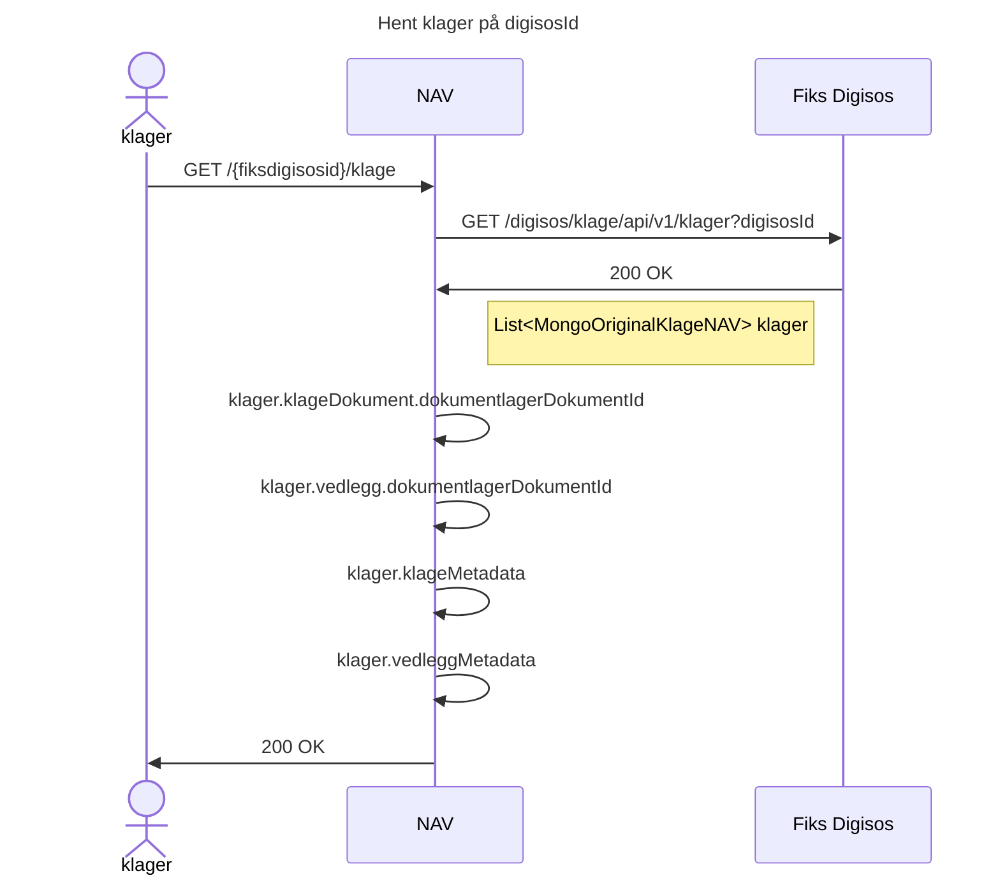
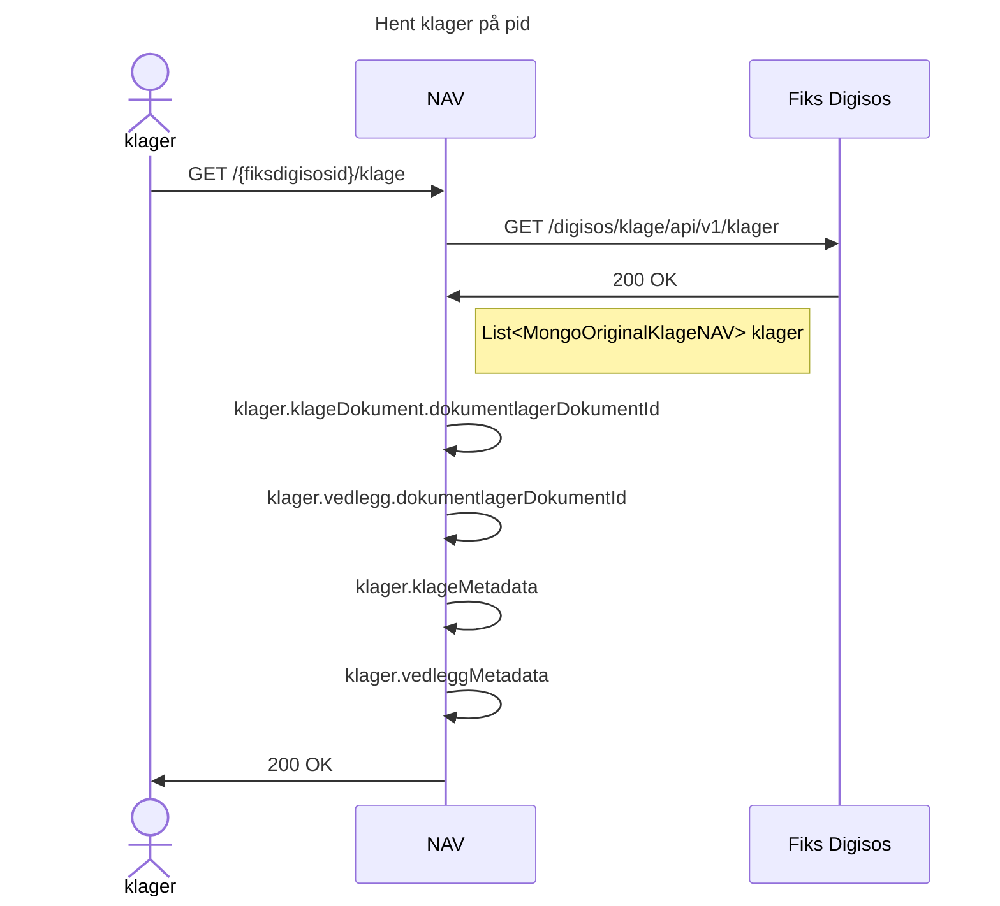
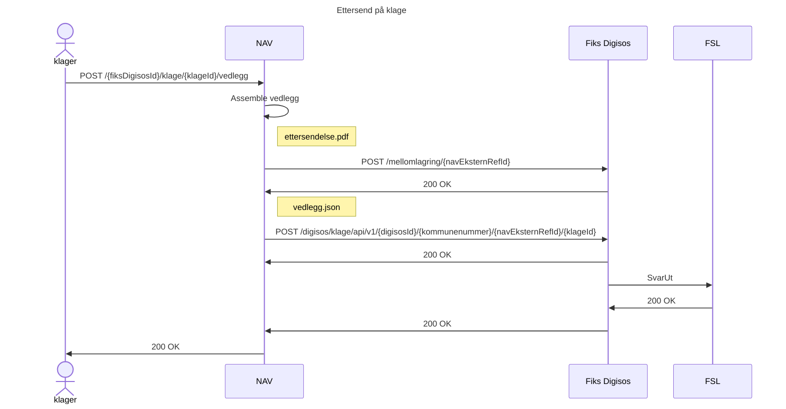
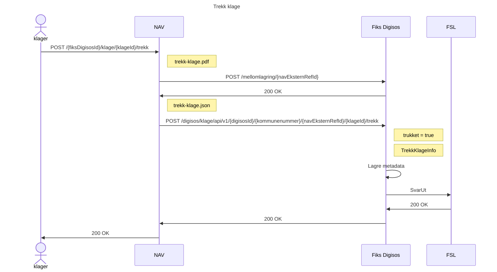
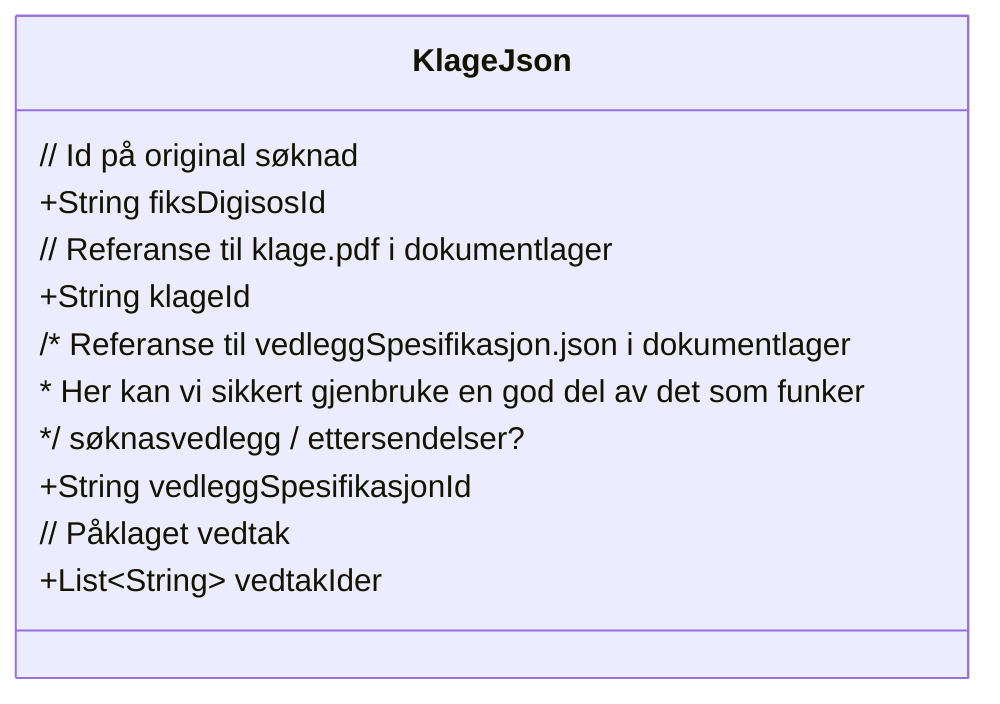
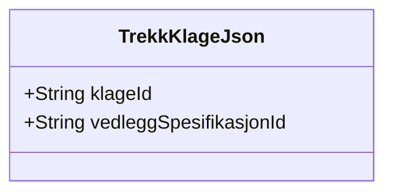
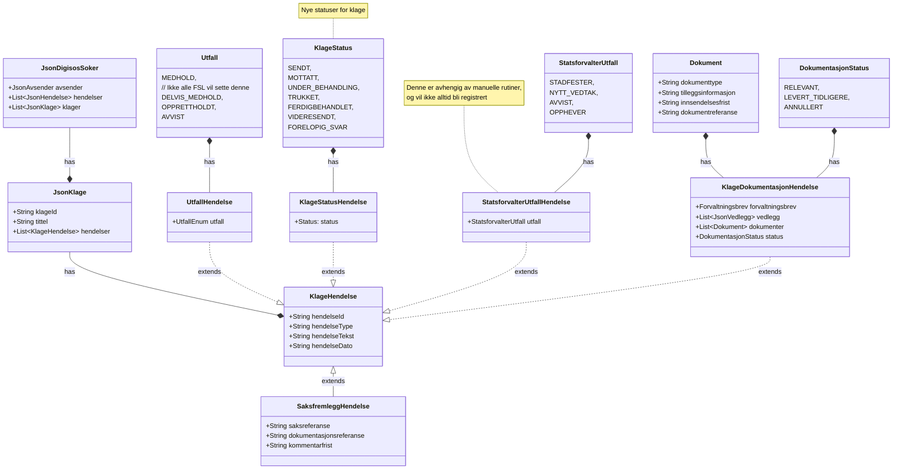

# Flyt
## Send klage

---
## Hent klager (digisosId) - valg 1

---
## Hent klager (pid) - valg 2

## Ettersendelse på klage

 
## Trekk klage

# Klasser/filformat


## Innsending av klage


## Eksempel:
### klage.json
```json
{
    "fiksDigisosId": "190923e4-330b-4ff7-97bd-05fe91ba2e41",
    "klageId": "43ec1b22-0449-4f55-bf00-6188268da3ac",
    "vedleggSpesifikasjonId": "3a3343a9-b7b9-4f83-b41c-ccd05239ae7d",
    "vedtakIder": ["77332878-8e66-420d-90f1-320a3a9fdc35", "2551f24e-df96-44c9-9b16-2614699fa1a3"]
}
```

### klage.pdf
```text
Hei, jeg klager på vedtaket deres. Jeg synes at begrunnelsen er fordi dårlig pga. ditten og datten. 
Se vedlegg som viser dette ytterligere. 

Mvh. Ola Nordmann
```

### vedlegg-spesifikasjon.json
```json
{
  "vedlegg": [
    {
      "type": "klage",
      "tilleggsinfo": "klage",
      "status": "LastetOpp",
      "filer": [
        {
          "navn": "klage.pdf",
          "dokumentlagerId": "43ec1b22-0449-4f55-bf00-6188268da3ac"
        },
        {
          "navn": "bevis.jpg",
          "dokumentlagerId": "3a3343a9-b7b9-4f83-b41c-ccd05239ae7d"
        }
      ],
      "hendelseType": null,
      "hendelseReferanse": null
    }
  ]
}
```
---

# Trekk klage

## Eksempel:
### trekk-klage.json
```json
{
    "klageId": "43ec1b22-0449-4f55-bf00-6188268da3ac",
    "vedleggSpesifikasjonId": "3a3343a9-b7b9-4f83-b41c-ccd05239ae7d",
    "timestamp": "12:34:56 1.aug.2020"
}
```

### vedlegg-spesifikasjon.json
```json
{
  "vedlegg": [
    {
      "type": "klage",
      "tilleggsinfo": "trekkKlage",
      "status": "LastetOpp",
      "filer": [
        {
          "navn": "trekk-klage.pdf",
          "dokumentlagerId": "43ec1b22-0449-4f55-bf00-6188268da3ac"
        }
      ],
      "hendelseType": null,
      "hendelseReferanse": null
    }
  ]
}

```

### trekk-klage.pdf
````text
Ola Nordmann trekker herved klagen sin. Handlingen ble utført på nav.no kl 13:37 den 13. august 2021.
```` 

---
# Hendelser klage


## Eksempler:
### Klage mottatt
```json
{
  "klageId": "43ec1b22-0449-4f55-bf00-6188268da3ac",
  "tittel": "Klage på vedtak",
  "hendelser": [
    {
      "hendelseId": "43ec1b22-0449-4f55-bf00-6188268da3ac",
      "hendelseType": "KlageStatusHendelse",
      "hendelseTekst": "Klage mottatt",
      "hendelseDato": "2021-08-13T13:37:00",
      "status": "MOTTATT"
    }
  ]
}
```

### Utfall registrert (medhold)
```json
{
    "klageId": "43ec1b22-0449-4f55-bf00-6188268da3ac",
    "tittel": "Klage på vedtak",
    "hendelser": [
        {
            "hendelseId": "43ec1b22-0449-4f55-bf00-6188268da3ac",
            "hendelseType": "UtfallHendelse",
            "hendelseTekst": "Medhold i klage",
            "hendelseDato": "2021-08-13T13:37:00",
            "utfall": "MEDHOLD"
        },
      {
        "hendelseId": "43ec1b22-0449-4f55-bf00-6188268da3ac",
        "hendelseType": "JsonVedtakFattet",
        "hendelseTekst": "Nytt vedtak fattet",
        "hendelseDato": "2021-08-13T13:37:00",
        "saksreferanse": "123456789",
        "utfall": "INNVILGET",
        "vedtaksfil": {
          "filreferanse": {
            "type": "DOKUMENTLAGER",
            "id": "776a8991-d778-4d77-828c-dd1126cf6e95"
          }
        },
        "vedlegg": []
      },
      {
        "hendelseId": "43ec1b22-0449-4f55-bf00-6188268da3ac",
        "hendelseType": "KlageStatusHendelse",
        "hendelseTekst": "Klage ferdigbehandlet",
        "hendelseDato": "2021-08-13T13:37:00",
        "status": "FERDIGBEHANDLET"
      }
    ]
}
```

### Utfall registrert (ikke medhold)
```json
{
  "klageId": "43ec1b22-0449-4f55-bf00-6188268da3ac",
  "tittel": "Klage på vedtak",
  "hendelser": [
    {
      "hendelseId": "43ec1b22-0449-4f55-bf00-6188268da3ac",
      "hendelseType": "UtfallHendelse",
      "hendelseTekst": "Vedtak opprettholdt",
      "hendelseDato": "2021-08-13T13:37:00",
      "utfall": "OPPRETTHOLDT"
    },
    {
      "hendelseId": "43ec1b22-0449-4f55-bf00-6188268da3ac",
      "hendelseType": "KlageStatusHendelse",
      "hendelseTekst": "Klage videresendt til statsforvalter",
      "hendelseDato": "2021-08-13T13:37:00",
      "status": "VIDERESENDT"
    }
  ]
}
```

#### Når statsforvalter er ferdig med klagen:
```json
{
  "klageId": "43ec1b22-0449-4f55-bf00-6188268da3ac",
  "tittel": "Klage på vedtak",
  "hendelser": [
    {
      "hendelseId": "43ec1b22-0449-4f55-bf00-6188268da3ac",
      "hendelseType": "StatsforvalterUtfallHendelse",
      "hendelseTekst": "Statsforvalter stadfester vedtaket",
      "hendelseDato": "2021-08-13T13:37:00",
      "utfall": "STADFESTER"
    },
    {
        "hendelseId": "43ec1b22-0449-4f55-bf00-6188268da3ac",
        "hendelseType": "KlageStatusHendelse",
        "hendelseTekst": "Klage ferdigbehandlet",
        "hendelseDato": "2021-08-13T13:37:00",
        "status": "FERDIGBEHANDLET"
    }
  ]
}
```

### Utfall registrert (ikke medhold, og statsforvalter fatter nytt vedtak)
```json
{
  "klageId": "43ec1b22-0449-4f55-bf00-6188268da3ac",
  "tittel": "Klage på vedtak",
  "hendelser": [
    {
      "hendelseId": "43ec1b22-0449-4f55-bf00-6188268da3ac",
      "hendelseType": "UtfallHendelse",
      "hendelseTekst": "Vedtak opprettholdt",
      "hendelseDato": "2021-08-13T13:37:00",
      "utfall": "OPPRETTHOLDT"
    },
    {
      "hendelseId": "43ec1b22-0449-4f55-bf00-6188268da3ac",
      "hendelseType": "KlageStatusHendelse",
      "hendelseTekst": "Klage videresendt til statsforvalter",
      "hendelseDato": "2021-08-13T13:37:00",
      "status": "VIDERESENDT"
    }
  ]
}
```

#### Når klage kommer tilbake fra statsforvalter:

```json
{
  "klageId": "43ec1b22-0449-4f55-bf00-6188268da3ac",
  "tittel": "Klage på vedtak",
  "hendelser": [
    {
      "hendelseId": "43ec1b22-0449-4f55-bf00-6188268da3ac",
      "hendelseType": "StatsforvalterUtfallHendelse",
      "hendelseTekst": "Statsforvalter har fattet nytt vedtak",
      "hendelseDato": "2021-08-13T13:37:00",
      "utfall": "NYTT_VEDTAK"
    },
    {
      "hendelseId": "43ec1b22-0449-4f55-bf00-6188268da3ac",
      "hendelseType": "JsonVedtakFattet",
      "hendelseTekst": "Nytt vedtak fattet",
      "hendelseDato": "2021-08-13T13:37:00",
      "saksreferanse": "123456789",
      "utfall": "INNVILGET",
      "vedtaksfil": {
        "filreferanse": {
          "type": "DOKUMENTLAGER",
          "id": "776a8991-d778-4d77-828c-dd1126cf6e94"
        }
      },
      "vedlegg": []
    },
    {
      "hendelseId": "43ec1b22-0449-4f55-bf00-6188268da3ac",
      "hendelseType": "KlageStatusHendelse",
      "hendelseTekst": "Klage ferdigbehandlet",
      "hendelseDato": "2021-08-13T13:37:00",
      "status": "FERDIGBEHANDLET"
    }
  ]
}
```

### Klage trukket (Bekreftelse på mottatt forsendelse fra NAV)
```json
{
  "klageId": "43ec1b22-0449-4f55-bf00-6188268da3ac",
  "tittel": "Klage på vedtak",
  "hendelser": [
    {
      "hendelseId": "43ec1b22-0449-4f55-bf00-6188268da3ac",
      "hendelseType": "KlageStatusHendelse",
      "hendelseTekst": "Klage trukket",
      "hendelseDato": "2021-08-13T13:37:00",
      "status": "TRUKKET"
    }
  ]
}
```

### Klagedokumentasjon etterspurt
```json
{
  "klageId": "43ec1b22-0449-4f55-bf00-6188268da3ac",
  "tittel": "Klage på vedtak",
  "hendelser": [
    {
      "hendelseId": "43ec1b22-0449-4f55-bf00-6188268da3ac",
      "hendelseType": "KlageDokumentasjonHendelse",
      "hendelseTekst": "Dokumentasjon vedrørende klagen er etterspurt",
      "hendelseDato": "2021-08-13T13:37:00",
      "klagedokumentasjonReferanse": "4c68bce6-c392-4f2c-a858-9c4ad626a3d5",
      "klageReferanse": "43ec1b22-0449-4f55-bf00-6188268da3ac",
      "tittel": "Dokumentasjon av klage",
      "beskrivelse": "Vi trenger mer dokumentasjon for å kunne behandle klagen din",
      "frist": "2021-08-20T13:37:00",
      "status": "RELEVANT"
    }
  ]
}
```
